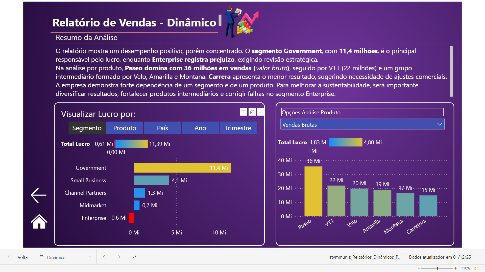

# Desafio de Projeto: Criando Relatórios Dinâmicos com o uso de Parâmetros no Power BI

## Introdução:
Este projeto apresenta a atualização de um relatório já criado anteriormente e foi desenvolvido para atender ao **Desafio de Projeto: Criando Relatórios Dinâmicos com o uso de Parâmetros no Power BI**, que integra o Bootcamp Klabin – Excel e Power BI Dashboards na DIO.

## Objetivo:

Adicionar uma nova página ao relatório criado anteriormente contemplando visuais dinâmicos com uso de parâmetros

## Atividades Realizadas:

- [X] *Adicionado **Página 5 - Relatório de Vendas Dinâmico** mantendo padrão de design anterior*;

- [X] *Criação de dois novos visuais dinâmicos `Análise de Lucro` e `Análise da Performance dos Produtos`;*

- [X] *Criação de storytelling para transformar os números em uma narrativa clara e envolvente, destacando o que realmente importa, facilitando decisões e conectando os dados ao contexto do negócio.*;
## Storytelling:
````
    O relatório mostra um desempenho positivo, porém concentrado. O segmento Government, com 11,4 milhões, é o principal responsável pelo lucro, enquanto Enterprise registra prejuízo, exigindo revisão estratégica.
    
    Na análise por produto, Paseo domina com 36 milhões em vendas (valor bruto), seguido por VTT (22 milhões) e um grupo intermediário formado por Velo, Amarilla e Montana. Carrera apresenta o menor resultado, sugerindo necessidade de ajustes comerciais.
    
    A empresa demonstra forte dependência de um segmento e de um produto. Para melhorar a sustentabilidade, será importante diversificar resultados, fortalecer produtos intermediários e corrigir falhas no segmento Enterprise.
````

## Pagina 5 - Relatório de Vendas Dinâmico:




<br>

## Arquivos:

- [X] Relatório Dinâmico (formato .pbix): [Clique aqui para visualizar o arquivo.](stvmmuniz_Relatórios_Dinâmicos_PBI_rev00.pbix)
 
- [X] Relatório Dinâmico (formato .pdf): [Clique aqui para visualizar o arquivo.](stvmmuniz_Relatórios_Dinâmicos_PBI_rev00.pdf)

     
<br><br>
**Escrito por:** *stvmmuniz*
